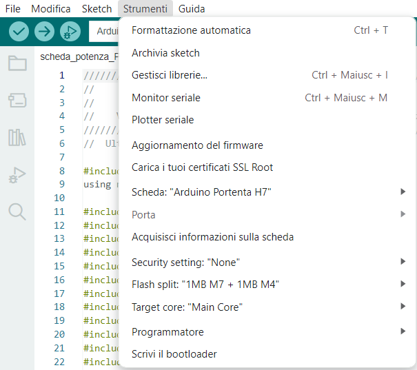

# FW_Portenta_Scanner_FM

**HARDWARE**
- Scheda Arduino "Portenta Machine Control"

**UPLOAD FIRMWARE**
- Collegarsi dal computer alla scheda tramite cavo usb
- Aprire Arduino IDE
- Scaricare all'interno di Arduino IDE il pacchetto di schede "Arduino Mbed OS Portenta Boards"
- Scaricare la libreria presente in questa repository, questa è dedicata alle schede presenti nel pacchetto precedentemente scaricato ed è stata modificata per ottimizzare l'utilizzo di questa scheda su quest'applicazione. Inserire la libreria scaricata nella cartella "libraries" dentro la cartella "Arduino" presente nel computer.
- Scaricare la versione del FW che si vuole caricare sulla scheda e aprire il file "___.ino" con Arduino IDE
- Impostare correttamente i parametri presenti nel menù a tendina "Strumenti"/"Tools"

- Selezionare la porta a cui è collegata la scheda
- Cliccare su "Carica"/"Upload" e attendere il pop-up "Caricamento completato"

**READ SERIAL**
- Collegare al computer il programmatore seriale e ad esso collegare un cavetto sul pin gnd e un cavetto sul pin rx, di conseguenza collegare il primo cavetto su un pin gnd della scheda e il secondo all'rx della scheda (dovrebbe esserci un cavetto arancione coperto da una guaina, togliere la guaina e collegarsi lì)
- Aprire Arduino IDE
- Selezionare la porta del programmatore seriale
- Aprire il monitor seriale e leggere i dati in arrivo
